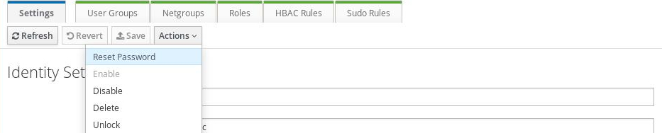
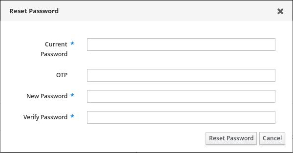
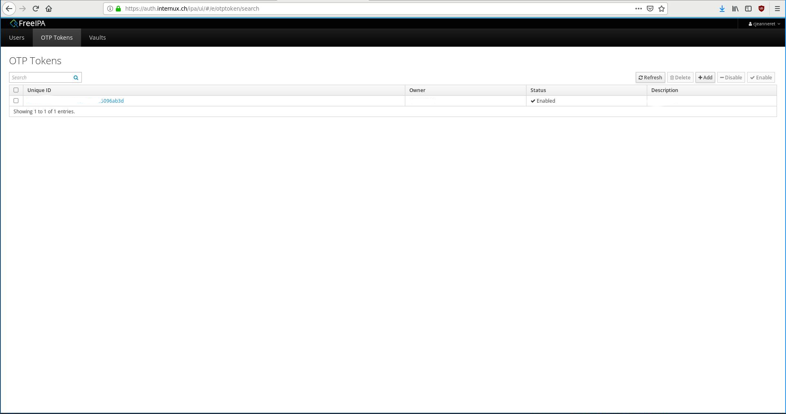
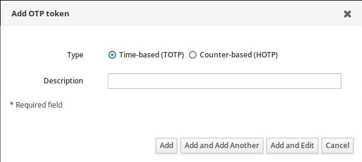
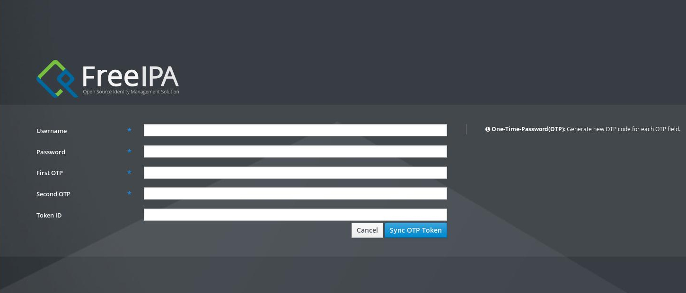

.. Documentation Internux documentation master file, created by
   sphinx-quickstart on Thu Dec 27 09:33:27 2018.
   You can adapt this file completely to your liking, but it should at least
   contain the root `toctree` directive.

Gestion des mots de passe
=========================

.. toctree::
   :maxdepth: 2
   :caption: Contents:

Changement de mot de passe
--------------------------

   * Connectez-vous sur https://auth.internux.ch/ipa/ui/
   * Cliquez sur le bouton "Actions"
   * Sélectionnez "Reset Password"

Une fois l'invite de changement de mot de passe affichée:

   * Renseignez le mot de passe actuel
   * Entrez au besoin l'OTP (voir plus bas)
   * Renseignez et confirmez le nouveau mot de passe

Configuration OTP
-----------------
OTP, pour One-Time-Password, ajoute une couche de sécurité à votre
authentification. En activant cette fonctionnalité, vous aurez une
authentification à trois clefs, au lieu de deux:

   * Nom d'utilisateur
   * Mot de passe
   * Token temporaire

Le Token temporaire (OTP) est généré par une application tierce, comme
c'est le cas pour se connecter à l'e-banking.

Dans le cas du système employé par Internux, il vous faut installer FreeOTP sur
Android_ et iOS_.

D'autres applications sont compatibles.

Il est à noter que l'OTP n'est exploitable que pour l'interface https://auth.internux.ch/ipa/ui/,
et pas pour la connexion au Webmail_ ou via votre client mail.

Différents type d'OTP
_____________________

La solution d'authentification supporte deux types d'OTP :

   * génération basée sur le temps (TOTP)
   * génération basée sur l'événement (HOTP)

Dans le premier cas (TOTP), le token est généré en fonction du temps uniquement, et change toutes les 30 secondes.

Dans le second cas (HTOP), chaque fois que vous cliquerez sur l'application, un token sera généré, avec une validité maximum
de 30 secondes. Cette variante est plus sécurisée, parce qu'une fois le token employé, il n'est plus valide, même durant
les 30 secondes de validité.

Générer un token
________________

Allez dans l'interface de gestion (`OTP Tokens`_). Là vous pouvez soit supprimer un token existant (en cas de perte, ou de changement
de smartphone par exemple), et générer différents tokens.

Concernant la génération, vous avez juste à entrer une description, et choisir le type de génération.

Une fois le token créé, il vous suffit de le synchroniser avec le système. Pour ce faire, il faut aller sur la `page d'authentification`_ et
cliquer sur le lien à côté du bouton "Log in" (Sync OTP Token).

Une interface vous demandant votre nom d'utilisateur, votre mot de passe ainsi que deux token sera affichée.

.. _Android: https://play.google.com/store/apps/details?id=org.fedorahosted.freeotp
.. _iOS: https://itunes.apple.com/us/app/freeotp-authenticator/id872559395
.. _Webmail: https://webmail.it-nux.ch/
.. _`OTP Tokens`: https://auth.internux.ch/ipa/ui/#/e/otptoken/search
.. _`page d'authentification`: https://auth.internux.ch/

